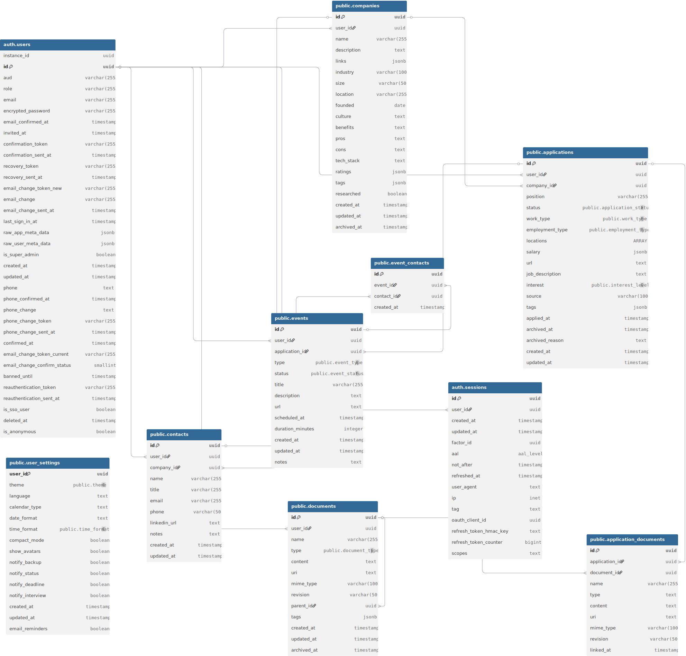

# Data Model

**Last updated:** 2026-03-05
**Status:** Reflects current migrations + planned additions from `prd-ai-integration.md`

---

## Diagram



> The diagram above reflects the tables present at the time it was generated. New tables from the AI integration PRD are documented below but not yet in the diagram.

---

## Overview

All application data lives in a single Postgres database managed by Supabase. The schema is organized into three logical groups:

| Group | Tables | Purpose |
| --- | --- | --- |
| **Job search core** | `companies`, `applications`, `events`, `contacts`, `event_contacts` | The primary tracking domain |
| **Documents** | `documents`, `application_documents` (→ `application_events_documents`) | Resume, cover letter, and AI-generated content |
| **User account** | `user_settings`, `user_integrations`, `user_oauth_tokens`, `user_consents` | Preferences, integrations, consent audit trail |
| **AI workflows** | `tasks` | Durable AI task execution records |

Every table except junction tables has a `user_id` column. Row Level Security (RLS) is enabled on every table without exception. A user can only ever see or modify their own data.

---

## Current Tables

### `companies`

Stores researched companies a user is tracking — regardless of whether they've applied.

| Column | Type | Notes |
| --- | --- | --- |
| `id` | `uuid` PK | `gen_random_uuid()` |
| `user_id` | `uuid` FK → `auth.users` | Cascade delete |
| `name` | `varchar(255)` | Unique per user (constraint `companies_user_id_name_unique`) |
| `description` | `text` | Free-form company description |
| `links` | `jsonb` | See JSONB schemas below |
| `industry` | `varchar(100)` | e.g. "FinTech", "Healthcare" |
| `size` | `varchar(50)` | e.g. "1–10", "51–200" |
| `locations` | `text[]` | Array of location strings (migrated from `location VARCHAR(255)` in `20260305000006`) |
| `founded` | `date` | Nullable |
| `culture` | `text` | Engineering culture notes |
| `benefits` | `text` | Benefits / compensation summary |
| `pros` | `text` | Candidate-perspective strengths |
| `cons` | `text` | Honest tradeoffs |
| `tech_stack` | `text` | Technologies in use |
| `ratings` | `jsonb` | See JSONB schemas below |
| `tags` | `jsonb` | Array of strings (stage, domain, work-type labels) |
| `researched` | `boolean` | `false` = bookmarked but not yet investigated |
| `notes` | `text` | Free-form research / outreach notes (added in `20260305000002`) |
| `created_at` | `timestamptz` | Auto-set |
| `updated_at` | `timestamptz` | Auto-updated by trigger |
| `archived_at` | `timestamptz` | Nullable; soft-delete |

**RLS:** `select_own`, `insert_own`, `update_own`, `delete_own` — all scoped to `user_id = auth.uid()`.

---

### `applications`

One row per job application. Always belongs to a company.

| Column | Type | Notes |
| --- | --- | --- |
| `id` | `uuid` PK | |
| `user_id` | `uuid` FK → `auth.users` | Cascade delete |
| `company_id` | `uuid` FK → `companies` | Cascade delete |
| `position` | `varchar(255)` | Job title |
| `status` | `text` | Enum: `bookmarked` \| `applied` \| `interviewing` \| `offer` \| `accepted` \| `rejected` \| `archived` |
| `work_type` | `text` | `remote` \| `hybrid-1day` … `hybrid-4day` \| `onsite` |
| `employment_type` | `text` | `full-time` \| `part-time` \| `contract` |
| `locations` | `text[]` | Array of location strings (migrated from single `location` in `20260228180000`) |
| `salary` | `jsonb` | See JSONB schemas below |
| `url` | `text` | Job posting URL |
| `job_description` | `text` | Full job description (markdown or plain text) |
| `interest` | `text` | `dream` \| `high` \| `medium` \| `low`; default `medium` |
| `source` | `varchar(100)` | Where the listing was found (e.g., "LinkedIn", "Referral") |
| `tags` | `jsonb` | Array of strings |
| `notes` | `text` | Free-form notes on the application (added in `20260305000003`) |
| `applied_at` | `timestamptz` | Default `now()` at UTC; nullable |
| `archived_at` | `timestamptz` | Nullable; excludes row from `total_applications` stat |
| `archived_reason` | `text` | Nullable; e.g., "Declined offer — accepted BigTech position" |
| `created_at` | `timestamptz` | |
| `updated_at` | `timestamptz` | Auto-updated by trigger |

**Status lifecycle:**

```text
bookmarked → applied → interviewing → offer → accepted
                   ↘ rejected
                   ↘ archived   (soft-removed from stats)
```

**RLS:** scoped to `user_id = auth.uid()`.

**Dashboard stat notes:**

- `total_applications` = count where `archived_at IS NULL`
- `active_applications` = count where `status IN ('applied', 'interviewing')` and `archived_at IS NULL`
- `response_rate` = applications with `status IN ('interviewing', 'offer', 'accepted')` / total non-archived

---

### `events`

Timeline entries for an application. Each application has an ordered sequence of events that tells the story of how the process unfolded.

| Column | Type | Notes |
| --- | --- | --- |
| `id` | `uuid` PK | |
| `user_id` | `uuid` FK → `auth.users` | Cascade delete |
| `application_id` | `uuid` FK → `applications` | Cascade delete |
| `type` | `text` | See event types below |
| `status` | `text` | See event statuses below |
| `title` | `varchar(255)` | Short description |
| `description` | `text` | Longer notes or context |
| `url` | `text` | Video call link, job board link, etc. |
| `scheduled_at` | `timestamptz` | Nullable; when the event is/was scheduled |
| `duration_minutes` | `integer` | Nullable |
| `notes` | `text` | Post-event notes (added in `20260221140001`) |
| `created_at` | `timestamptz` | |
| `updated_at` | `timestamptz` | Auto-updated by trigger |

**Event types:**

| Type | Meaning |
| --- | --- |
| `bookmarked` | Application saved without applying (auto-created by trigger on insert) |
| `applied` | Application submitted (auto-created when status → `applied`) |
| `screening-interview` | Recruiter or phone screen |
| `behavioral-interview` | Soft-skills / culture interview |
| `technical-interview` | Technical / coding interview |
| `online-test` | Async coding challenge |
| `take-home` | Take-home assignment |
| `onsite` | On-site or final-round interview |
| `offer` | Offer extended |
| `rejection` | Application rejected |

**Event statuses:**

`availability-requested` | `availability-submitted` | `scheduled` | `completed` | `cancelled` | `rescheduled` | `no-show`

**RLS:** scoped to `user_id = auth.uid()`.

**Indexes:** `(user_id)`, `(application_id)`, `(user_id, scheduled_at)`.

---

### `contacts`

People the user has met, researched, or plans to reach out to in connection with their job search.

| Column | Type | Notes |
| --- | --- | --- |
| `id` | `uuid` PK | |
| `user_id` | `uuid` FK → `auth.users` | Cascade delete |
| `company_id` | `uuid` FK → `companies` | Nullable; `ON DELETE SET NULL` |
| `name` | `varchar(255)` | |
| `title` | `varchar(255)` | Job title |
| `email` | `varchar(255)` | Nullable |
| `phone` | `varchar(50)` | Nullable |
| `linkedin_url` | `text` | Nullable |
| `notes` | `text` | Conversation history, personality notes, thank-you context |
| `source` | `varchar(100)` | Where the contact was found (e.g., "LinkedIn", "Referral"); added in `20260305000005` |
| `archived_at` | `timestamptz` | Nullable; soft-delete (added in `20260305000004`) |
| `created_at` | `timestamptz` | |
| `updated_at` | `timestamptz` | Auto-updated by trigger |

**RLS:** scoped to `user_id = auth.uid()`.

---

### `event_contacts`

Junction table linking contacts to the events they participated in (e.g., interviewers per interview round).

| Column | Type | Notes |
| --- | --- | --- |
| `id` | `uuid` PK | |
| `event_id` | `uuid` FK → `events` | Cascade delete |
| `contact_id` | `uuid` FK → `contacts` | Cascade delete |
| `created_at` | `timestamptz` | |

**Constraint:** `UNIQUE(event_id, contact_id)` — no duplicate contact per event.

**RLS:** scoped via `event_id IN (SELECT id FROM events WHERE user_id = auth.uid())`.

**Indexes:** `(event_id)`, `(contact_id)`.

---

### `documents`

User-uploaded and AI-generated documents (resumes, cover letters, research, drafts).

| Column | Type | Notes |
| --- | --- | --- |
| `id` | `uuid` PK | |
| `user_id` | `uuid` FK → `auth.users` | Cascade delete |
| `name` | `varchar(255)` | Display name |
| `type` | `text` | `resume` \| `cover_letter` \| `portfolio` \| `certification` \| `other` |
| `content` | `text` | Full document content; format determined by `mime_type` |
| `uri` | `text` | Nullable; Supabase Storage path when file is uploaded |
| `mime_type` | `varchar(100)` | `text/markdown`, `application/pdf`, `text/plain`, `text/html` |
| `revision` | `varchar(50)` | Version label (e.g., "3", "v2-fullstack") |
| `parent_id` | `uuid` FK → `documents` | Self-referencing; supports revision chains |
| `tags` | `jsonb` | Array of strings |
| `source` | `text` | *(planned)* `'user'` \| `'ai_generated'` |
| `status` | `text` | *(planned)* `'draft'` \| `'active'` \| `'approved'` \| `'sent'` \| `'archived'` |
| `task_id` | `uuid` FK → `tasks` | *(planned)* Links document to the AI task that generated it |
| `created_at` | `timestamptz` | |
| `updated_at` | `timestamptz` | Auto-updated by trigger |
| `archived_at` | `timestamptz` | Nullable; soft-delete |

**Revision model:** each refinement of a document (user edits, AI re-draft) creates a new row with `parent_id` pointing to its predecessor. The most recent document in the chain is the current version. For company research, each interview round gets its own document with `parent_id` always pointing back to the root base document — not the prior round's document.

**Content format convention:** `mime_type` is the authoritative content contract. AI-generated content defaults to `text/markdown`. The frontend renders `text/markdown` via `react-markdown`. The `type` column describes what the document *is*; `mime_type` describes how it's encoded.

**RLS:** scoped to `user_id = auth.uid()`.

---

### `application_documents` (→ `application_events_documents`)

Snapshot table that records which documents were used for a given application, and optionally which event (e.g., resume submitted at `applied` event, draft linked to a specific interview). Documents are copied at link time so the historical record is immutable even if the source document is later revised.

> **Note:** This table will be renamed to `application_events_documents` and gain an `event_id` column per the AI integration PRD.

| Column | Type | Notes |
| --- | --- | --- |
| `id` | `uuid` PK | |
| `application_id` | `uuid` FK → `applications` | Cascade delete |
| `document_id` | `uuid` FK → `documents` | Cascade delete |
| `event_id` | `uuid` FK → `events` | *(planned)* Nullable; preferred when a natural event exists |
| `name` | `varchar(255)` | Copied from document at link time |
| `type` | `text` | Copied from document at link time |
| `content` | `text` | Copied from document at link time |
| `uri` | `text` | Copied from document at link time |
| `mime_type` | `varchar(100)` | Copied from document at link time |
| `revision` | `varchar(50)` | Copied from document at link time |
| `linked_at` | `timestamptz` | When the document was attached |

**RLS:** scoped via `application_id IN (SELECT id FROM applications WHERE user_id = auth.uid())`.

---

### `user_settings`

One row per user, auto-created on signup via `on_auth_user_created` trigger.

| Column | Type | Default | Notes |
| --- | --- | --- | --- |
| `id` | `uuid` PK | `gen_random_uuid()` | Surrogate primary key (added in `20260305000001`) |
| `user_id` | `uuid` FK → `auth.users` | | Cascade delete; UNIQUE constraint (previously was the PK) |
| `theme` | `text` | `'dark'` | `'light'` \| `'dark'` |
| `language` | `text` | `'en'` | |
| `calendar_type` | `text` | `'gregorian'` | |
| `date_format` | `text` | `'MM/DD/YYYY'` | |
| `time_format` | `text` | `'12h'` | `'12h'` \| `'24h'` |
| `compact_mode` | `boolean` | `false` | |
| `show_avatars` | `boolean` | `true` | |
| `notify_backup` | `boolean` | `true` | |
| `notify_status` | `boolean` | `true` | |
| `notify_deadline` | `boolean` | `true` | |
| `notify_interview` | `boolean` | `true` | |
| `email_reminders` | `boolean` | `true` | Added in `20260221120000` |
| `ai_features_enabled` | `boolean` | `false` | *(planned)* Master AI toggle |
| `ai_contact_research` | `boolean` | `false` | *(planned)* Auto-trigger contact research on apply |
| `ai_email_drafts` | `boolean` | `false` | *(planned)* Enable email draft + Gmail send |
| `ai_company_research` | `boolean` | `false` | *(planned)* Auto-trigger research when interview scheduled |
| `ai_thank_you_notes` | `boolean` | `false` | *(planned)* Auto-trigger thank-you drafts post-interview |
| `ai_setup_banner_dismissed` | `boolean` | `false` | *(planned)* Hides the AI features discovery banner |
| `notify_ai_tasks` | `boolean` | `true` | *(planned)* Include pending tasks in daily digest email |
| `created_at` | `timestamptz` | `now()` | |
| `updated_at` | `timestamptz` | | Auto-updated by trigger |

All AI flag columns default to `false` — opt-in only, never opt-out.

**RLS:** `select_own`, `insert_own`, `update_own` — no delete policy (settings row is permanent for the life of the account).

---

## Planned Tables (AI Integration PRD)

These tables are not yet in the database. They will be added as part of the AI features implementation.

---

### `tasks`

The central entity for AI workflows. One row per AI workflow execution. Tasks are durable — they survive server restarts and retain full history including failed and terminated runs.

| Column | Type | Notes |
| --- | --- | --- |
| `id` | `uuid` PK | |
| `user_id` | `uuid` FK → `auth.users` | Cascade delete |
| `application_id` | `uuid` FK → `applications` | Cascade delete |
| `trigger_event_id` | `uuid` FK → `events` | Nullable; `ON DELETE SET NULL` |
| `type` | `text` | `contact_research` \| `email_draft` \| `company_research` \| `thank_you_draft` |
| `status` | `text` | See task status lifecycle below |
| `title` | `text` | Short human-readable label |
| `payload` | `jsonb` | AI outputs (contact candidates, metadata, etc.) |
| `feedback` | `text` | User's latest refinement feedback |
| `terminated_reason` | `text` | Filled when `status = 'terminated'` |
| `iteration` | `integer` | Number of refinement rounds completed; default 0 |
| `error` | `text` | Technical error when `status = 'failed'` or `'blocked'` |
| `error_class` | `text` | `auth` \| `rate_limit` \| `transient` \| `bad_request` |
| `retry_count` | `integer` | Default 0 |
| `next_retry_at` | `timestamptz` | Nullable; worker skips until `now() >= next_retry_at` |
| `created_at` | `timestamptz` | |
| `updated_at` | `timestamptz` | Auto-updated by trigger |

**Task status lifecycle:**

```text
pending → running → awaiting_approval → approved → completed
        ↘ needs_input                 ↘ terminated
        ↘ blocked (auth error)
        ↘ running (retry/backoff)
          ↘ failed (max retries exceeded)
```

| Status | Meaning |
| --- | --- |
| `pending` | Created, waiting to start |
| `running` | AI actively working (includes retry attempts in backoff) |
| `needs_input` | Missing required context; surfaced in inbox with a completion action |
| `blocked` | Integration auth error; will not attempt until key is fixed |
| `awaiting_approval` | AI produced output; waiting for human decision |
| `approved` | Human approved; downstream action triggered |
| `terminated` | Human rejected/cancelled; reason recorded in `terminated_reason` |
| `completed` | All downstream actions finished successfully |
| `failed` | Max retries exceeded or non-retriable data error |

**One task per document, always.** A task produces zero or one documents. It is never associated with multiple documents simultaneously.

**Indexes:** `(user_id)`, `(application_id)`, `(user_id, status)`, `(trigger_event_id)`.

**RLS:** scoped to `user_id = auth.uid()`.

---

### `user_integrations`

Single source of truth for every external service credential — API keys and OAuth connections alike. One row per user per provider.

| Column | Type | Notes |
| --- | --- | --- |
| `id` | `uuid` PK | |
| `user_id` | `uuid` FK → `auth.users` | Cascade delete |
| `provider` | `text` | `'inngest'` \| `'anthropic'` \| `'apollo'` \| `'google'` |
| `api_key` | `text` | Nullable; null for OAuth providers (Google). Plain text during dev; Vault-encrypted before any real users |
| `status` | `text` | `'unconfigured'` \| `'ok'` \| `'error'` |
| `last_error` | `text` | Human-readable message from last health check or failed operation |
| `last_checked_at` | `timestamptz` | Nullable |
| `error_class` | `text` | `'auth'` \| `'rate_limit'` \| `'transient'` \| null |
| `retry_after` | `timestamptz` | Nullable; set on rate-limit errors; cleared when quota restores |
| `created_at` | `timestamptz` | |
| `updated_at` | `timestamptz` | Auto-updated by trigger |

**Constraint:** `UNIQUE(user_id, provider)`.

**Inngest is a prerequisite.** If `status != 'ok'` for provider `'inngest'`, no AI tasks are dispatched.

**Env var fallback (priority order):** user key in `api_key` → env var (`INNGEST_API_KEY`, `ANTHROPIC_API_KEY`, `APOLLO_API_KEY`) → disabled. Key resolution is server-side only; env vars are never exposed to the client.

**Index:** `(user_id)`.

**RLS:** `select_own`, `insert_own`, `update_own`, `delete_own`.

---

### `user_oauth_tokens`

Stores OAuth access and refresh tokens for providers that use OAuth (currently Google/Gmail only). Separate from `user_integrations` to keep credential material isolated.

| Column | Type | Notes |
| --- | --- | --- |
| `id` | `uuid` PK | |
| `user_id` | `uuid` FK → `auth.users` | Cascade delete |
| `provider` | `text` | `'google'` |
| `access_token` | `text` | Plain text during dev; Vault-encrypted pre-release |
| `refresh_token` | `text` | Nullable |
| `token_expiry` | `timestamptz` | Nullable |
| `granted_scopes` | `text[]` | Default `'{}'`; tracks which OAuth scopes the user has granted |
| `created_at` | `timestamptz` | |
| `updated_at` | `timestamptz` | Auto-updated by trigger |

**Constraint:** `UNIQUE(user_id, provider)`.

`granted_scopes` is the source of truth for Gmail permissions. Before any send, check `'gmail.send' = ANY(granted_scopes)`.

**Security pre-release gate:** Encryption at rest via Supabase Vault is required before this table holds any real user tokens. This is not optional.

**RLS:** `select_own`, `insert_own`, `update_own`, `delete_own`.

---

### `user_consents`

Append-only audit table. A record is inserted every time a user grants or revokes consent for a data-sharing feature. Never updated or deleted.

| Column | Type | Notes |
| --- | --- | --- |
| `id` | `uuid` PK | |
| `user_id` | `uuid` FK → `auth.users` | Cascade delete |
| `consent_type` | `text` | `'ai_features'` \| `'anthropic_data'` \| `'apollo_data'` \| `'gmail_send'` |
| `granted` | `boolean` | `true` = consent given; `false` = consent revoked |
| `version` | `text` | Identifier of the disclosure text version they agreed to |
| `created_at` | `timestamptz` | |

**Revocation:** insert a new row with `granted = false` rather than deleting the prior row. The audit trail is permanent.

**RLS:** `select_own`, `insert_own` — no update or delete.

---

## Database Infrastructure

### Triggers

| Trigger | Table | Function | When |
| --- | --- | --- | --- |
| `companies_updated_at` | `companies` | `update_updated_at()` | Before update |
| `applications_updated_at` | `applications` | `update_updated_at()` | Before update |
| `events_updated_at` | `events` | `update_updated_at()` | Before update |
| `documents_updated_at` | `documents` | `update_updated_at()` | Before update |
| `contacts_updated_at` | `contacts` | `update_updated_at()` | Before update |
| `user_settings_updated_at` | `user_settings` | `update_updated_at()` | Before update |
| `on_auth_user_created` | `auth.users` | `create_user_settings()` | After insert |
| `on_application_created` | `applications` | `create_initial_application_event()` | *(planned)* After insert |
| `on_application_status_applied` | `applications` | `create_applied_event_on_status_change()` | *(planned)* After update of `status` |

### Functions

**`update_updated_at()`** — Sets `NEW.updated_at = now()` before every update. Attached to every table that has an `updated_at` column.

**`create_user_settings()`** — Inserts a default `user_settings` row when a new `auth.users` row is created. `SECURITY DEFINER` so it can write to `public.user_settings` from an `auth` schema trigger.

**`create_initial_application_event()`** *(planned)* — On application insert, auto-creates a `bookmarked` or `applied` initial event depending on the application's starting `status`.

**`create_applied_event_on_status_change()`** *(planned)* — On application update, inserts an `applied` event when `status` transitions from `bookmarked` → `applied`.

**`get_dashboard_stats()`** — `SECURITY DEFINER` RPC that returns an aggregated JSON object with counts for `total_applications`, `interviews_upcoming`, `active_applications`, `offers`, `rejections`, `contacts`, `companies`, and `response_rate`. Called from the client as `supabase.rpc('get_dashboard_stats')`.

### Indexes

| Index | Table | Columns |
| --- | --- | --- |
| `idx_applications_user_id` | `applications` | `(user_id)` |
| `idx_applications_company_id` | `applications` | `(company_id)` |
| `idx_applications_status` | `applications` | `(user_id, status)` |
| `idx_companies_user_id` | `companies` | `(user_id)` |
| `idx_companies_name` | `companies` | `(user_id, name)` |
| `idx_events_user_id` | `events` | `(user_id)` |
| `idx_events_application_id` | `events` | `(application_id)` |
| `idx_events_scheduled` | `events` | `(user_id, scheduled_at)` |
| `idx_documents_user_id` | `documents` | `(user_id)` |
| `idx_documents_task_id` | `documents` | `(task_id)` *(planned)* |
| `idx_contacts_user_id` | `contacts` | `(user_id)` |
| `idx_application_documents_app` | `application_documents` | `(application_id)` |
| `idx_application_events_documents_event` | `application_events_documents` | `(event_id)` *(planned)* |
| `idx_event_contacts_event` | `event_contacts` | `(event_id)` |
| `idx_event_contacts_contact` | `event_contacts` | `(contact_id)` |
| `idx_tasks_user_id` | `tasks` | `(user_id)` *(planned)* |
| `idx_tasks_application_id` | `tasks` | `(application_id)` *(planned)* |
| `idx_tasks_status` | `tasks` | `(user_id, status)` *(planned)* |
| `idx_tasks_trigger_event` | `tasks` | `(trigger_event_id)` *(planned)* |
| `idx_user_integrations_user` | `user_integrations` | `(user_id)` *(planned)* |

### Storage

A private Supabase Storage bucket named `documents` holds uploaded files. The path convention is `{user_id}/{filename}`, enforced by the storage RLS policy:

```sql
CREATE POLICY "Users can manage own files"
  ON storage.objects FOR ALL
  USING (bucket_id = 'documents' AND (storage.foldername(name))[1] = auth.uid()::text)
  WITH CHECK (bucket_id = 'documents' AND (storage.foldername(name))[1] = auth.uid()::text);
```

The `documents.uri` column stores the path within this bucket when a file is backed by storage.

---

## JSONB Schemas

### `companies.links`

```json
{
  "website":   "https://example.com/",
  "careers":   "https://example.com/careers",
  "news":      "https://example.com/blog",
  "linkedin":  "https://linkedin.com/company/example",
  "glassdoor": "https://glassdoor.com/Overview/Working-at-example.htm",
  "crunchbase": "https://crunchbase.com/organization/example"
}
```

All keys are optional. Store only what is known.

### `companies.ratings`

```json
{
  "overall":        4.2,
  "workLifeBalance": 4.0,
  "compensation":   4.5,
  "careerGrowth":   4.3,
  "culture":        4.0,
  "management":     4.1
}
```

Values are floats 0–5. All keys are optional.

### `applications.salary`

```json
{
  "currency": "USD",
  "period":   "annual",
  "min":      150000,
  "max":      200000
}
```

All keys optional. `period`: `"annual"` | `"hourly"` | `"monthly"`.

### `tasks.payload` (contact_research)

```json
{
  "candidates": [
    {
      "name":       "Jane Smith",
      "title":      "VP Engineering",
      "email":      "jane@company.com",
      "linkedin":   "https://linkedin.com/in/jsmith",
      "source":     "apollo",
      "confidence": "high",
      "rationale":  "VP Eng at 50-person Series B, directly manages hiring"
    }
  ],
  "search_query": "...",
  "notes": "Found 3 candidates; 1 high-confidence, 2 possible"
}
```

---

## Design Principles

**User data isolation.** Every application table has a `user_id` column. RLS policies on every table guarantee a user can only read or write their own rows. No exceptions.

**No implicit deletes.** Cascade deletes are explicit in every FK definition. Soft-deletes via `archived_at` are used where history must be preserved (companies, documents).

**Append-only audit trail.** `user_consents` is insert-only by design. RLS has no `update_own` or `delete_own` policy. Consent history is permanent.

**Timestamp consistency.** All timestamps are `TIMESTAMPTZ` (UTC). The `updated_at` trigger is applied to every mutable table. Never use `TIMESTAMP WITHOUT TIME ZONE`.

**Enums as text.** Enum-like columns are stored as `TEXT` rather than Postgres `ENUM` types, making migrations easier. Valid values are documented above and validated at the application layer.

**JSONB for flexible schemas.** `salary`, `links`, `ratings`, `tags`, and `payload` use `jsonb` because their structure is either variable or frequently extended. All other structured data uses discrete columns.

**Schema changes via migrations only.** All DDL goes through `supabase/migrations/`. Never alter tables directly in the Supabase dashboard.

**One migration per logical change.** Migration filenames are timestamped and descriptive. Each file should represent one coherent change; compound changes that must be atomic are acceptable in a single file.

---

## Migration History

| File | Change |
| --- | --- |
| `20260217040609_initial_schema.sql` | All core tables, RLS, triggers, `get_dashboard_stats` RPC, storage bucket |
| `20260217120000_event_contacts.sql` | `event_contacts` junction table |
| `20260221120000_add_email_reminders_to_settings.sql` | `user_settings.email_reminders` column |
| `20260221130000_add_interview_reminder_cron.sql` | pg_cron job for interview reminder notifications |
| `20260221140000_applied_at_default.sql` | `applications.applied_at` default → `now() AT TIME ZONE 'utc'` |
| `20260221140001_events_notes.sql` | `events.notes` column |
| `20260228180000_application_locations.sql` | `applications.location` (varchar) → `locations` (text[]) |
| `20260302213309_companies_unique_user_name.sql` | `UNIQUE(user_id, name)` constraint on `companies` |
| `20260305000001_user_settings_id.sql` | Adds surrogate UUID PK to `user_settings`; `user_id` becomes FK + UNIQUE |
| `20260305000002_companies_notes.sql` | `companies.notes TEXT` column |
| `20260305000003_applications_notes.sql` | `applications.notes TEXT` column |
| `20260305000004_contacts_archived_at.sql` | `contacts.archived_at TIMESTAMPTZ` for soft-delete |
| `20260305000005_contacts_source.sql` | `contacts.source VARCHAR(100)` |
| `20260305000006_companies_locations.sql` | Migrates `companies.location VARCHAR` → `locations TEXT[]` |
| `20260305000007_fix_dashboard_stats.sql` | `get_dashboard_stats` excludes archived companies and contacts |

---

## Appendix: DBML Schema

> Reflects the schema at diagram generation time. The planned tables and columns documented above are not included.

```dbml
Enum auth.aal_level {
  aal2
  aal3
  aal1
}

Table auth.sessions {
   id uuid  [primary key]
   user_id uuid [ref: > auth.users.id]
   created_at timestamp
   updated_at timestamp
   factor_id uuid
   aal aal_level
   not_after timestamp  [note: 'Auth: Not after is a nullable column that contains a timestamp after which the session should be regarded as expired.']
   refreshed_at timestamp
   user_agent text
   ip inet
   tag text
   oauth_client_id uuid
   refresh_token_hmac_key text  [note: 'Holds a HMAC-SHA256 key used to sign refresh tokens for this session.']
   refresh_token_counter bigint  [note: 'Holds the ID (counter) of the last issued refresh token.']
   scopes text

  note: 'Auth: Stores session data associated to a user.'
}

Table auth.users {
   instance_id uuid
   id uuid  [primary key]
   aud varchar(255)
   role varchar(255)
   email varchar(255)
   encrypted_password varchar(255)
   email_confirmed_at timestamp
   invited_at timestamp
   confirmation_token varchar(255)
   confirmation_sent_at timestamp
   recovery_token varchar(255)
   recovery_sent_at timestamp
   email_change_token_new varchar(255)
   email_change varchar(255)
   email_change_sent_at timestamp
   last_sign_in_at timestamp
   raw_app_meta_data jsonb
   raw_user_meta_data jsonb
   is_super_admin boolean
   created_at timestamp
   updated_at timestamp
   phone text
   phone_confirmed_at timestamp
   phone_change text
   phone_change_token varchar(255)
   phone_change_sent_at timestamp
   confirmed_at timestamp
   email_change_token_current varchar(255)
   email_change_confirm_status smallint  [default: 0]
   banned_until timestamp
   reauthentication_token varchar(255)
   reauthentication_sent_at timestamp
   is_sso_user boolean  [note: 'Auth: Set this column to true when the account comes from SSO. These accounts can have duplicate emails.', default: false]
   deleted_at timestamp
   is_anonymous boolean  [default: false]

  Note: 'Auth: Stores user login data within a secure schema.'
}

Enum application_status {
  bookmarked
  applied
  interviewing
  offer
  accepted
  rejected
  archived
}

Enum work_type {
  "remote"
  "hybrid-1day"
  "hybrid-2day"
  "hybrid-3day"
  "hybrid-4day"
  "onsite"
}

Enum employment_type {
  "full-time"
  "part-time"
  "contract"
}

Enum interest_level {
  dream
  high
  medium
  low
}

Table application_documents {
   id uuid  [default: `gen_random_uuid()`, pk]
   application_id uuid [ref: > applications.id]
   document_id uuid [ref: > documents.id]
   name varchar(255) [note: 'Copied from document at link time']
   type text [note: 'Copied from document at link time']
   content text [note: 'Copied from document at link time']
   uri text [note: 'Copied from document at link time']
   mime_type varchar(100) [note: 'Copied from document at link time']
   revision varchar(50) [note: 'Copied from document at link time']
   linked_at timestamp  [default: `now()`]

  Note: ''
}

Table applications {
   id uuid  [default: `gen_random_uuid()`, pk]
   user_id uuid [ref: > auth.users.id]
   company_id uuid [ref: > companies.id]
   position varchar(255)
   status application_status
   work_type work_type
   employment_type employment_type
  locations ARRAY
   salary jsonb [note: '''
    example schema

    {
      currency: "USD",
      period: "annual",
      min: 100000,
      max: 200000
    }
  ''']
   url text
   job_description text
   interest interest_level [default: interest_level.medium]
   source varchar(100)
   tags jsonb [note: 'array of strings']
   applied_at timestamp [null]
   archived_at timestamp [null]
   archived_reason text [null]
   created_at timestamp  [default: `now()`]
   updated_at timestamp  [default: `now()`]

  Note: ''
}

Table companies {
   id uuid  [default: `gen_random_uuid()`, pk]
   user_id uuid [ref: > auth.users.id]
   name varchar(255)
   description text
   links jsonb [note: '''
    example schema

    {
      website: "https://example.com/",
      careers: "https://example.com/careers",
      news: "https://example.com/blog",
      linkedin: "https://linkedin.com/companies/example",
      glassdoor: "https://example.com/working-at-example.htm",
      crunchbase: "https://example.com/companies/example"
    }
  ''']
   industry varchar(100)
   size varchar(50) [note: '1-10, etc']
   location varchar(255) [note: 'City, ST']
   founded date [null]
   culture text
   benefits text
   pros text
   cons text
   tech_stack text
   ratings jsonb [note: '''
    example schema

    {
      overall: 4.2,
      workLifeBalance: 4.0,
      compensation: 4.5,
      careerGrowth: 4.3,
      culture: 4.0,
      management: 4.1
    }
  ''']
   tags jsonb
   researched boolean [default: false]
   created_at timestamp [default: `now()`]
   updated_at timestamp [default: `now()`]
   archived_at timestamp

  Note: ''
}

Enum event_type {
  "screening-interview"
  "technical-interview"
  "behavioral-interview"
  "online-test"
  "take-home"
  "onsite"
  "offer"
  "rejection"
  "bookmarked"
  "applied"
}

Enum event_status {
  "availability-requested"
  "availability-submitted"
  "scheduled"
  "completed"
  "cancelled"
  "rescheduled"
  "no-show"
}

Table events {
   id uuid  [default: `gen_random_uuid()`, pk]
   user_id uuid [ref: > auth.users.id]
   application_id uuid [ref: > applications.id]
   type event_type
   status event_status
   title varchar(255)
   description text
   url text
   scheduled_at timestamp [null]
   duration_minutes integer [null]
   created_at timestamp  [default: `now()`]
   updated_at timestamp  [default: `now()`]
   notes text

  Note: ''
}

Table contacts {
   id uuid  [default: `gen_random_uuid()`, pk]
   user_id uuid [ref: > auth.users.id]
  company_id uuid [null, ref: > companies.id]
   name varchar(255)
   title varchar(255)
   email varchar(255)
   phone varchar(50)
   linkedin_url text
   notes text
   created_at timestamp  [default: `now()`]
   updated_at timestamp  [default: `now()`]

  Note: ''
}

Enum document_type {
  resume
  cover_letter
  portfolio
  certification
  other
}

Table documents {
   id uuid  [default: `gen_random_uuid()`, pk]
   user_id uuid [ref: > auth.users.id]
   name varchar(255)
   type document_type
   content text
   uri text
   mime_type varchar(100)
   revision varchar(50)
   parent_id uuid [null, ref: > documents.id]
   tags jsonb
   created_at timestamp  [default: `now()`]
   updated_at timestamp  [default: `now()`]
   archived_at timestamp

  Note: ''
}

Table event_contacts {
   id uuid  [default: `gen_random_uuid()`, pk]
   event_id uuid [ref: > events.id]
   contact_id uuid [ref: > contacts.id]
   created_at timestamp  [default: `now()`]

  Note: ''
}

Enum theme {
  light
  dark
}

Enum time_format {
  24h
  12h
}

Table user_settings {
   user_id uuid [pk, note: 'should be fk to auth.users, missing id col']
   theme theme [default: theme.dark]
   language text [default: 'en']
   calendar_type text [default: 'gregorian']
   date_format text [default: 'MM/DD/YYYY']
   time_format time_format [default: time_format.12h]
   compact_mode boolean  [default: false]
   show_avatars boolean  [default: true]
   notify_backup boolean  [default: true]
   notify_status boolean  [default: true]
   notify_deadline boolean  [default: true]
   notify_interview boolean  [default: true]
   created_at timestamp  [default: `now()`]
   updated_at timestamp  [default: `now()`]
   email_reminders boolean  [default: true]

  Note: ''
}
```
